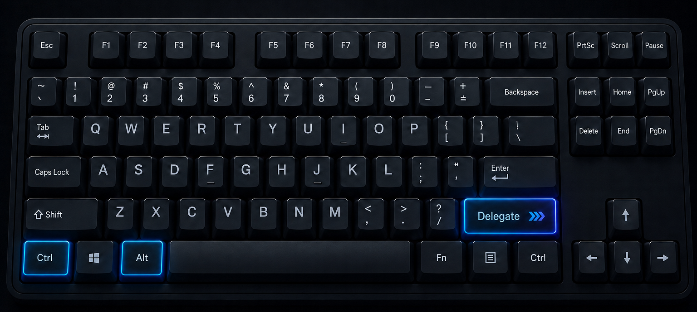

<div align="center">

<!--
Replace the path below with the final logo path.
Recommended repository location:
assets/branding/ctrlaltdelegate-logo.svg
-->



# CtrlAltDelegate

### Plan deeply. Delegate precisely. Verify everything.

**An evidence-driven software planning, engineering, and autonomous delivery system for modern coding agents.**

CtrlAltDelegate turns a software objective into a structured, implementation-ready engineering program and carries it through autonomous execution, verification, recovery, documentation, and Git synchronization.

**GitHub Native Edition**

[](#adaptive-execution)
[](#planning-system)
[](#supported-coding-agent-harnesses)

<!-- Replace this URL with the public Custom GPT URL -->
[**Open the CtrlAltDelegate Custom GPT →**](https://chatgpt.com/g/g-6a79d4471dfc8191a8c29ba36cb25787-ctrlaltdelegate-v5-6-1)

</div>

---

## What is CtrlAltDelegate?

CtrlAltDelegate is a complete software-planning and autonomous-delivery methodology designed for AI coding agents.

It is not just:

- a prompt;
- a collection of coding rules;
- a task generator;
- a project template;
- an agent persona;
- or a library of reusable skills.

It is a persistent engineering system that connects:

```text
PRODUCT INTENT
      ↓
COLLABORATIVE DISCOVERY
      ↓
REQUIREMENTS & CONSTRAINTS
      ↓
CURRENT TECHNICAL RESEARCH
      ↓
STACK SELECTION
      ↓
ARCHITECTURE
      ↓
PROGRAM DESIGN
      ↓
SKILL ROUTING
      ↓
EXECUTION RIGHTSIZING
      ↓
DEPENDENCY DAG / MILESTONES
      ↓
AUTONOMOUS IMPLEMENTATION
      ↓
REVIEW & ADVERSARIAL VERIFICATION
      ↓
RUNTIME ACCEPTANCE
      ↓
DOCUMENTATION
      ↓
GIT / GITHUB CHECKPOINTS
      ↓
CONVERGENCE
      ↓
COMPLETED
```

The objective is simple:

> Give a capable coding agent enough structured engineering context, authority, specialist knowledge, verification criteria, and persistent state to deliver software with minimal repeated user intervention.

CtrlAltDelegate is designed around the idea that autonomous coding becomes significantly more reliable when the agent is not asked to improvise the entire software-development process from a single prompt.

Instead, planning, architecture, implementation, verification, recovery, and handoff are represented explicitly and persisted inside the repository.

---

# Why CtrlAltDelegate exists

Modern coding agents are already capable of writing large amounts of production-quality code.

The difficult part is usually not generating code.

The difficult parts are:

- understanding what should actually be built;
- resolving missing product requirements;
- choosing technologies for the right reasons;
- preserving an existing system instead of redesigning it unnecessarily;
- discovering hidden dependencies;
- defining stable contracts;
- coordinating work across multiple files and layers;
- selecting the right specialist knowledge;
- avoiding unnecessary abstractions;
- handling migrations and irreversible changes safely;
- verifying that changes actually work;
- distinguishing evidence from agent claims;
- keeping documentation synchronized;
- recovering after failures, context loss, or provider limits;
- coordinating parallel agents without creating integration chaos;
- and knowing when the project is actually complete.

CtrlAltDelegate treats those problems as first-class engineering responsibilities.

---

# Core philosophy

CtrlAltDelegate follows several core principles.

### Plan enough to remove implementation ambiguity

The goal of planning is not maximum documentation.

The goal is:

> **minimum implementation ambiguity.**

Small tasks should remain small.

Complex or high-risk systems receive deeper planning because their uncertainty and blast radius justify it.

---

### Evidence beats confidence

An agent saying:

> "Done."

is not proof.

Completion should be supported by evidence such as:

- tests;
- build output;
- static analysis;
- runtime behavior;
- API responses;
- browser journeys;
- screenshots;
- database checks;
- migration verification;
- metrics;
- query plans;
- packet/network evidence;
- Git diffs;
- deployment health checks;
- or other domain-appropriate artifacts.

---

### Use the smallest correct solution

CtrlAltDelegate intentionally resists unnecessary software complexity.

Its preferred implementation order is approximately:

```text
EXISTING REPOSITORY REUSE
        ↓
STANDARD LIBRARY / RUNTIME
        ↓
NATIVE PLATFORM CAPABILITY
        ↓
EXISTING PROJECT DEPENDENCY
        ↓
SMALL DIRECT IMPLEMENTATION
        ↓
NEW DEPENDENCY
        ↓
NEW ABSTRACTION / INFRASTRUCTURE
```

A new dependency, service, abstraction, queue, cache, database, framework, or infrastructure layer should exist because a real requirement justifies it — not because it is fashionable.

This is the purpose of the system's **Solution Minimization Gate**.

---

### Preserve proven brownfield architecture

Existing repositories are not greenfield playgrounds.

CtrlAltDelegate inspects and preserves:

- existing architecture;
- repository conventions;
- dependency choices;
- runtime assumptions;
- build systems;
- public contracts;
- user work;
- branch state;
- migrations;
- local tooling;
- and operational behavior.

A proven existing stack is preserved by default unless requirements or evidence justify changing it.

---

### Make agent autonomy explicit

The coding agent should not constantly return routine technical decisions to the user.

Once requirements and constraints are sufficiently clear, normal engineering decisions can remain autonomous.

User escalation is reserved for material boundaries such as:

- product or scope changes;
- possible data loss;
- weaker security or privacy;
- material recurring cost;
- significant vendor or business commitments;
- compliance exceptions;
- unavailable credentials;
- or approvals that only the user can provide.

---

# Two complementary parts

CtrlAltDelegate is distributed in two complementary forms.

## 1. GitHub Native Edition

**This repository is the primary distribution.**

The GitHub Native Edition contains the complete execution-oriented system:

- agent instructions;
- canonical specialist skills;
- progressive specialist references;
- routing configuration;
- planning templates;
- persistent execution state;
- autonomous execution rules;
- Git and GitHub workflows;
- verification contracts;
- documentation lifecycle;
- context management;
- recovery behavior;
- validation scripts;
- skill evaluations;
- harness compatibility guidance;
- and repository-root-ready project delivery infrastructure.

This is the version intended to live with the codebase and guide coding agents throughout implementation.

---

## 2. CtrlAltDelegate Custom GPT

<!-- Replace https://chatgpt.com/g/g-6a79d4471dfc8191a8c29ba36cb25787-ctrlaltdelegate-v5-6-1 with the final public GPT URL -->

**[Open the CtrlAltDelegate Custom GPT →](https://chatgpt.com/g/g-6a79d4471dfc8191a8c29ba36cb25787-ctrlaltdelegate-v5-6-1)**

The Custom GPT is the interactive planning interface for CtrlAltDelegate.

It is optimized for collaborative project discovery before autonomous coding begins.

The Custom GPT helps turn an idea into an implementation-ready software specification through:

- collaborative discovery;
- workflow design;
- requirement clarification;
- opportunity scanning;
- scope control;
- technical-preference discovery;
- current technical research;
- technology selection;
- architecture;
- program design;
- security and reliability planning;
- testing strategy;
- execution planning;
- specialist-skill selection;
- and coding-agent handoff.

Instead of asking the user to complete one giant questionnaire, discovery happens in focused rounds.

The system follows an adaptive loop:

```text
UNDERSTAND
   ↓
CLARIFY
   ↓
OPPORTUNITY SCAN
   ↓
SUGGEST / CHALLENGE
   ↓
USER OR AUTO DECISION
   ↓
REFINE
```

The Custom GPT ultimately produces a **repo-root-ready coding-agent delivery package** that can be placed into a Git repository and executed using the GitHub Native system.

### Recommended end-to-end workflow

```text
USER IDEA
   ↓
CTRLALTDELEGATE CUSTOM GPT
   ↓
DISCOVERY
   ↓
RESEARCH
   ↓
ARCHITECTURE
   ↓
PROGRAM DESIGN
   ↓
EXECUTION PLAN
   ↓
REPO-ROOT-READY DELIVERY
   ↓
GITHUB REPOSITORY
   ↓
CODING AGENT
   ↓
AUTONOMOUS EXECUTION
   ↓
VERIFICATION
   ↓
COMPLETED
```

The GitHub-native repository remains the canonical execution environment.

The Custom GPT is an optional high-quality planning front end.

---

# What CtrlAltDelegate can handle

The system is intentionally broad.

Examples include:

### Web applications

- SaaS products
- internal tools
- dashboards
- admin systems
- portals
- marketplaces
- e-commerce
- collaboration tools
- authentication-heavy applications
- real-time applications

### Websites

- marketing websites
- content websites
- landing pages
- SEO-focused websites
- existing-site modernization
- design-system rebuilds
- performance modernization
- accessibility remediation

### Backend systems

- REST APIs
- GraphQL
- RPC
- event-driven systems
- webhooks
- queues
- background jobs
- distributed services
- integration layers

### Data systems

- relational databases
- SQLite
- PostgreSQL
- MongoDB
- analytical databases
- ETL / ELT
- data pipelines
- search
- vector search
- RAG systems
- data migrations

### AI and agent systems

- LLM applications
- tool-using agents
- RAG systems
- AI evaluation
- memory systems
- MCP servers
- model integrations
- agent orchestration
- machine-learning systems

### Mobile and native

- Android
- Kotlin
- iOS
- Swift / SwiftUI
- React Native
- Flutter
- cross-platform applications
- desktop applications

### Infrastructure

- CI/CD
- containers
- Kubernetes
- Terraform
- cloud platforms
- Cloudflare
- serverless
- reverse proxies
- DNS / DHCP
- VPNs and overlays
- virtualization
- homelabs

### Network platforms

- UniFi / Ubiquiti
- OPNsense
- OpenWrt
- network automation
- topology changes
- firewall and routing work
- safe network migration

### Existing repositories

- feature development
- debugging
- architecture continuation
- refactoring
- dependency upgrades
- framework migrations
- audits
- remediation
- security hardening
- performance work
- release engineering

---

# System architecture

CtrlAltDelegate separates persistent engineering policy from project-specific implementation knowledge.

A simplified view:

```text
┌──────────────────────────────────────────────┐
│             USER / PRODUCT INTENT            │
└──────────────────────┬───────────────────────┘
                       │
                       ▼
┌──────────────────────────────────────────────┐
│             PLANNING SYSTEM                  │
│                                              │
│ Discovery                                    │
│ Requirements                                 │
│ Constraints                                  │
│ Research                                     │
│ Stack                                        │
│ Architecture                                 │
│ Program Design                               │
└──────────────────────┬───────────────────────┘
                       │
                       ▼
┌──────────────────────────────────────────────┐
│          PERSISTENT REPOSITORY STATE         │
│                                              │
│ planning/                                    │
│ ADRs                                         │
│ STACK-MANIFEST                               │
│ SKILLS-MANIFEST                              │
│ STATE                                        │
│ Execution Plan                               │
│ Evidence                                     │
└──────────────────────┬───────────────────────┘
                       │
                       ▼
┌──────────────────────────────────────────────┐
│             EXECUTION ORCHESTRATOR           │
│                                              │
│ Rightsizing                                  │
│ DAG / Milestones                             │
│ Worker Routing                               │
│ Git Isolation                                │
│ Integration                                  │
│ Recovery                                     │
└───────────────┬──────────────────────────────┘
                │
                ▼
┌──────────────────────────────────────────────┐
│              SPECIALIST SKILLS               │
│                                              │
│ Language                                     │
│ Framework                                    │
│ Database                                     │
│ Security                                     │
│ Infrastructure                               │
│ Product / UX                                 │
│ Testing                                      │
│ AI / Agents                                  │
│ Network                                      │
│ Delivery                                     │
└───────────────┬──────────────────────────────┘
                │
                ▼
┌──────────────────────────────────────────────┐
│               IMPLEMENTATION                 │
└───────────────┬──────────────────────────────┘
                │
                ▼
┌──────────────────────────────────────────────┐
│          REVIEW / TEST / VERIFICATION        │
└───────────────┬──────────────────────────────┘
                │
                ▼
┌──────────────────────────────────────────────┐
│          GIT / RUNTIME / DOCUMENTATION       │
└───────────────┬──────────────────────────────┘
                │
                ▼
           COMPLETED
```

---

# Planning system

Planning is treated as collaborative engineering design rather than passive intake.

The planner resolves:

### Product

- problem being solved;
- target users;
- desired outcome;
- workflows;
- roles;
- business rules;
- MVP;
- later scope;
- non-goals;
- edge cases;
- recovery paths;
- success criteria.

### Technical constraints

Before architecture is frozen, CtrlAltDelegate resolves:

1. desired level of technical involvement;
2. technologies that are required, preferred, or unwanted;
3. runtime / hosting / environment expectations;
4. data sensitivity;
5. security requirements;
6. geographic or residency constraints;
7. network exposure;
8. existing infrastructure.

Preferences use three authority levels:

```text
REQUIRED
PREFERRED
AUTO
```

### REQUIRED

A hard constraint.

Incompatible options are eliminated.

### PREFERRED

A strong preference.

It influences the decision but may be overridden when evidence shows a meaningful technical conflict.

### AUTO

The planner is explicitly authorized to choose based on requirements and evidence.

This lets both beginners and experienced engineers use the same planning system without forcing either group into an inappropriate workflow.

---

# Research model

CtrlAltDelegate does not assume that framework, provider, platform, pricing, compatibility, or version-specific knowledge remains permanently correct.

Material decisions can trigger current research.

Research priority is generally:

```text
REPOSITORY / RUNTIME EVIDENCE
          ↓
FIRST-PARTY DOCUMENTATION
          ↓
SPECIFICATIONS / RELEASE NOTES
          ↓
OFFICIAL SOURCE REPOSITORIES / ISSUES
          ↓
STRONG INDEPENDENT SOURCES
          ↓
COMMUNITY OPERATIONAL EXPERIENCE
```

Community sources can be useful for discovering real-world friction.

They do not replace first-party security, compliance, or compatibility authority.

---

## Execution-time research

Planning research is reused rather than repeated unnecessarily.

During implementation, new research is classified as:

```text
NONE
VERIFY_DRIFT
TARGETED
SPIKE
```

### `NONE`

Existing evidence is sufficient.

### `VERIFY_DRIFT`

A version-sensitive or provider-sensitive fact should be rechecked.

### `TARGETED`

One specific decision requires additional research.

### `SPIKE`

A small executable experiment is more reliable than additional documentation reading.

This prevents both extremes:

- blindly relying on stale assumptions;
- constantly stopping implementation to research information that is already known.

---

# Stack selection

Technology selection follows requirements rather than predetermined stack preferences.

Greenfield stack selection can evaluate:

- primary language;
- runtime;
- framework;
- rendering model;
- API architecture;
- relational database;
- embedded database;
- analytical database;
- search;
- vector search;
- cache;
- queue;
- stream;
- background workers;
- native targets;
- deployment platform;
- containers;
- orchestration;
- AI / ML surfaces;
- MCP;
- network platforms;
- external providers.

Selection considers factors such as:

- correctness fit;
- maturity;
- maintenance;
- developer velocity;
- performance headroom;
- operational complexity;
- portability;
- cost;
- ecosystem quality;
- lock-in;
- existing infrastructure.

Ordinary requirements should generally receive mature, boring technology rather than unnecessary architectural novelty.

---

# Brownfield first

For an existing repository, stack detection starts from repository evidence.

Examples include:

```text
pyproject.toml
go.mod
Cargo.toml
tsconfig.json
package.json
pom.xml
build.gradle
.csproj
.sln
CMakeLists.txt
composer.json
Gemfile
Package.swift
Android configuration
Flutter configuration
React Native dependencies
```

These signals help identify specialist knowledge.

They do **not** override the actual repository.

Before broad changes, brownfield work performs repository onboarding to understand:

- Git state;
- uncommitted user work;
- current baseline SHA;
- architecture;
- build commands;
- test commands;
- runtime;
- dependencies;
- public contracts;
- data stores;
- integrations;
- deployment;
- existing failures.

Unrelated user work must not be destroyed, reset, silently absorbed, or reformatted away.

---

# Program Design Gate

Architecture alone does not tell a coding agent how a large change should fit into a real codebase.

For substantive cross-file or cross-layer work, CtrlAltDelegate performs a **Program Design Gate** before broad implementation.

The gate resolves the lightest sufficient version of:

- reuse opportunities;
- affected modules;
- file placement;
- public contracts;
- public types;
- call flow;
- data flow;
- state ownership;
- failure boundaries;
- recovery behavior;
- testing shape;
- evidence shape.

The purpose is not to prescribe every private method.

The purpose is to prevent expensive architectural discovery after a large diff already exists.

---

# Vertical-slice-first implementation

When the dependency graph allows it, CtrlAltDelegate prefers:

```text
MINIMAL END-TO-END SLICE
        ↓
VERIFY
        ↓
EXPAND
        ↓
VERIFY
        ↓
HARDEN
        ↓
VERIFY
```

over:

```text
BUILD ENTIRE DATABASE LAYER
        ↓
BUILD ENTIRE BACKEND
        ↓
BUILD ENTIRE FRONTEND
        ↓
DISCOVER INTEGRATION PROBLEMS
```

An early executable slice provides evidence that the chosen architecture actually works.

This creates an opportunity to re-steer before large amounts of implementation accumulate.

---

# Adaptive execution

Not every software change deserves enterprise-scale process ceremony.

CtrlAltDelegate classifies execution using:

```text
MICRO
SMALL
STANDARD
HIGH_RISK
```

The profile is determined from factors such as:

- scope;
- coupling;
- security;
- privacy;
- data risk;
- deployment complexity;
- runtime complexity;
- migration reversibility;
- operational blast radius;
- verification cost.

## MICRO

Typical examples:

- tiny isolated bug;
- small configuration adjustment;
- simple localized behavior change.

The system may use a single coherent milestone rather than generating many jobs, branches, reviews, and evidence documents.

## SMALL

Typical examples:

- contained feature;
- small vertical slice;
- limited multi-file change.

Quality remains high, but process overhead is reduced.

## STANDARD

Typical examples:

- substantial product feature;
- meaningful cross-layer implementation;
- new application capability;
- multi-job execution.

Uses structured milestones/jobs, explicit dependencies, routed review, evidence, and integration.

## HIGH_RISK

Typical examples:

- authentication or authorization boundaries;
- migrations;
- high-value data;
- security-sensitive systems;
- network reachability;
- infrastructure changes;
- difficult rollback;
- large operational blast radius.

Uses stronger isolation, deeper review, adversarial verification, rollback planning, and more explicit evidence.

## Quality does not scale down

Execution ceremony is adaptive.

Engineering quality is not.

Even MICRO and SMALL work can still require:

- correctness;
- security;
- accessibility;
- tests;
- documentation;
- runtime verification;
- recovery handling;
- or specialist review

when the actual requirement or risk demands it.

---

# Skill system

CtrlAltDelegate includes:

> **A broad library of first-party specialist skills**

The exact library size may grow or change over time. The important design rule is that the full library is never loaded into every agent context; only the smallest complete set relevant to the project and current job is routed.

The number is intentionally not a design limit.

A new skill is justified when a recurring responsibility has sufficiently distinct:

- decisions;
- invariants;
- failure modes;
- verification requirements;
- or domain expertise.

## Skills are not all loaded

The complete library is a repository resource.

It is **not** injected into every agent context.

Routing follows:

```text
FULL LIBRARY
    ↓
PROJECT PROFILE
    ↓
STACK
    ↓
PROJECT-SELECTED SKILLS
    ↓
JOB CHANGE/RISK TRIGGERS
    ↓
EXACT JOB-REQUIRED SKILLS
    ↓
OPTIONAL RELEVANT REFERENCES
```

Every worker receives the **smallest complete expert set** required for its job.

This reduces:

- irrelevant instructions;
- context consumption;
- contradictory guidance;
- and unnecessary cognitive load.

## Canonical skill layout

```text
.agents/
└── skills/
    ├── CATALOG.yaml
    ├── SOURCE-RESEARCH-MATRIX.yaml
    │
    ├── <skill-id>/
    │   ├── SKILL.md
    │   └── references/
    │       └── ...
    │
    └── ...
```

`SKILL.md` is the normal specialist entry point.

Deep specialist material lives under `references/` and is loaded only when relevant.

The skill library also includes progressive reference material that is loaded only when relevant.

---

# Skill categories

The library spans a wide engineering surface.

Representative categories include:

## Core engineering

- implementation engineering
- systematic debugging
- code review
- test engineering
- verification gates
- solution minimization
- adversarial verification
- formal verification
- property-based testing
- performance profiling
- documentation engineering
- context efficiency

## Architecture

- backend architecture
- frontend architecture
- distributed systems
- API contracts
- auth architecture
- integration engineering
- event systems
- background jobs
- monorepos
- build systems
- deployment architecture

## Languages

Specialist guidance exists across major ecosystems, including:

- C
- C++
- Rust
- Go
- Python
- Java / JVM
- Kotlin
- TypeScript / Node.js
- .NET
- F#
- PHP
- Ruby
- Swift
- and additional language environments

## Frameworks and platforms

Examples include specialist coverage for:

- Angular
- React ecosystems
- Next.js
- Astro
- Django
- native mobile
- React Native
- Flutter
- Cloudflare
- WordPress
- and other application platforms

## Data

- database design
- migrations
- database operations
- PostgreSQL
- SQLite
- MongoDB
- analytical databases
- data engineering
- search
- vectors
- caching
- data lifecycle

## Security

- security review
- authentication
- authorization
- threat modeling
- dependency supply chain
- secrets
- application boundaries
- security-sensitive infrastructure

## Infrastructure and network

- CI/CD
- infrastructure as code
- Terraform
- Kubernetes
- containers
- DNS / DHCP
- VPN
- reverse proxy
- network automation
- UniFi
- OPNsense
- OpenWrt
- backup and disaster recovery

## Frontend and product

- UX product design
- UI design systems
- component engineering
- responsive design
- accessibility
- browser acceptance
- frontend performance
- visual polish
- motion
- SEO
- content
- conversion workflows

## AI and data intelligence

- agent application engineering
- AI evaluation
- MCP
- RAG
- machine learning
- model-backed applications
- retrieval and memory architecture

---

# Shared execution contract

Generic agent behavior is deliberately **not duplicated across the specialist skill library**.

Global policy lives in:

```text
docs/system/SKILL-EXECUTION-CONTRACT.md
```

Specialist skills focus primarily on their own domain:

- material decisions;
- invariants;
- failure modes;
- verification;
- version drift;
- relevant references.

This prevents hundreds of skill files from independently redefining:

- autonomy;
- escalation;
- research policy;
- evidence;
- routing;
- or completion rules.

---

# Job-level routing

A project may make many skills available.

A worker should not automatically read them all.

Every meaningful delegated job specifies:

- exact skill IDs;
- canonical paths;
- why the skill is needed;
- required worker capabilities;
- research need.

The worker reads those skills before implementation and reports:

```text
SKILLS_APPLIED
```

If implementation reveals a new material stack or domain trigger, the future routing plan is updated instead of silently continuing with incomplete specialist context.

---

# Execution DAG and milestones

Larger work is represented as a dependency graph.

A job can define:

```text
Objective
Requirement IDs
Dependencies
Baseline
Allowed Scope
Protected Scope
Inputs
Outputs
Required Worker Capabilities
Required Skills
Research Need
Program Design Context
Verification
Evidence
Documentation Impact
Runtime Impact
Rollback
```

Independent jobs may run in parallel.

Dependent or shared-contract work remains coordinated.

---

# Bottleneck-aware parallelism

More agents do not automatically mean faster delivery.

CtrlAltDelegate asks:

> What is currently limiting end-to-end progress?

Possible bottlenecks include:

- implementation;
- integration;
- tests;
- CI;
- review;
- deployment;
- runtime verification.

Parallel jobs are dispatched when they create useful throughput.

The system avoids generating large amounts of writer work that only wait in front of a saturated integration or verification stage.

The objective is:

> **maximize completed value, not agent count.**

---

# Single-writer boundaries

Parallel workers must not independently redesign the same shared contract.

Examples of sensitive shared surfaces include:

- database schemas;
- shared API contracts;
- authentication boundaries;
- central configuration;
- common types;
- deployment topology.

Where necessary, one worker owns the shared surface and dependent jobs build against the agreed contract.

---

# Git and worktree model

For standard parallel execution, work can be isolated using Git branches and worktrees.

Example:

```text
main

└── agent/wave-02-payments

    ├── agent/job-JOB-011-payment-api
    ├── agent/job-JOB-012-payment-ui
    └── agent/job-JOB-013-payment-tests
```

The orchestrator:

1. dispatches work;
2. reviews actual diffs;
3. accepts or rejects job results;
4. integrates accepted commits;
5. resolves conflicts centrally;
6. runs integrated verification;
7. updates the wave;
8. checkpoints validated work.

MICRO and SMALL execution may use lighter Git ceremony where isolation adds no value.

---

# GitHub behavior

The system can work with an existing GitHub remote.

Where an authorized harness has write capability, the system may also perform direct GitHub handoff according to repository and user policy.

The normal behavior is:

- reuse an existing valid `origin`;
- discover the default branch;
- inspect current `main`;
- respect branch protection;
- respect required PRs and checks;
- commit logical changes;
- push meaningful checkpoints;
- keep validated `main` synchronized.

The system must **not** weaken branch protection to make autonomous execution easier.

If human approval is technically required by repository policy, that is treated as a real external blocker rather than bypassed.

---

# Persistent repository memory

Agent conversations are temporary.

The repository is durable.

CtrlAltDelegate stores material project state under:

```text
planning/
```

This directory is intended to remain versioned with the project.

It is not temporary packaging.

Representative structure:

```text
planning/
├── PROJECT.md
├── REQUIREMENTS.md
│
├── discovery/
│   ├── DISCOVERY-STATE.md
│   └── TECHNICAL-PREFERENCES.yaml
│
├── architecture/
│   ├── STACK-MANIFEST.yaml
│   └── ...
│
├── research/
│   └── ...
│
├── context/
│   └── PROJECT-CONTEXT.md
│
├── repository/
│   └── ...
│
├── execution/
│   ├── STATE.md
│   ├── EXECUTION-PROFILE.yaml
│   ├── EXECUTION-PLAN.md
│   ├── SKILLS-MANIFEST.yaml
│   ├── AUTOPILOT-GOAL.md
│   └── ...
│
└── handoff/
    ├── CODING-AGENT-HANDOFF.md
    ├── FINAL-START-PROMPT.md
    └── ...
```

---

# `STATE.md`

One of the most important files is:

```text
planning/execution/STATE.md
```

It provides a compact current execution snapshot.

State is updated after meaningful boundaries such as:

- completed jobs;
- integrated waves;
- material commits;
- pushes;
- runtime application;
- blockers;
- restarts;
- resume;
- context resets;
- convergence updates;
- verification verdicts.

This means the system can recover from context loss using repository truth instead of relying on an old conversation transcript.

---

# Context-rot resistance

Long-running agent sessions can degrade as context becomes increasingly large and stale.

CtrlAltDelegate mitigates this through:

- persistent repository state;
- fresh worker contexts;
- fresh reviewer contexts;
- scoped specialist loading;
- Git as execution truth;
- explicit handoffs;
- compact state;
- evidence indexes;
- context epochs.

A new worker should reconstruct its job from durable project artifacts instead of needing the full history of every previous conversation.

---

# Worker liveness and recovery

A long-running worker is not considered failed merely because it has been running for a long time.

CtrlAltDelegate distinguishes:

```text
MEANINGFUL PROGRESS
QUIET
STALLED / FAILED
```

Meaningful progress means the worker should normally continue.

A quiet worker receives a health check before cancellation.

Elapsed wall-clock time by itself is not considered sufficient stall evidence.

Where provider limits or crashes are possible, the system prefers:

```text
CHECKPOINT
    ↓
VERIFY GIT / FILE STATE
    ↓
RESUME
```

instead of:

```text
KILL
    ↓
START OVER
```

Repeated failures can trigger:

- job resizing;
- worker capability rerouting;
- debugging;
- narrower decomposition;
- or recovery from the last valid checkpoint.

---

# Continuation states

The orchestrator uses explicit continuation states rather than stopping simply because one agent finished.

Representative states include:

```text
CONTINUE
CONTINUE_OTHER_WORK
REPAIR_RETRY
RECONCILE_STATE
RESTART_REQUIRED
DECISION_REQUIRED
BLOCKED_EXTERNAL
RETRY_EXHAUSTED
POLICY_DENIED
PAUSED
COMPLETED
```

The system should continue while dependency-ready work remains available.

---

# Verification model

CtrlAltDelegate treats a worker result as a **claim** until it has sufficient evidence.

Verification can include:

- unit tests;
- integration tests;
- contract tests;
- E2E tests;
- browser testing;
- static analysis;
- linting;
- type checking;
- security checks;
- runtime requests;
- deployment checks;
- migration checks;
- database invariants;
- screenshots;
- performance measurements;
- query plans;
- packet/network validation;
- logs;
- actual Git diffs.

The type of evidence depends on the type of claim.

---

# Convergence

A project is not complete simply because all jobs show `DONE`.

Mandatory requirements should converge across:

```text
PLAN
 ↓
JOB
 ↓
CODE
 ↓
TEST / EVIDENCE
 ↓
DOCUMENTATION
```

CtrlAltDelegate maintains convergence information using artifacts such as:

```text
CONVERGENCE-MATRIX.json
```

This allows the system to answer:

- Which requirement caused this implementation?
- Which job implemented it?
- Where is the resulting code?
- What proves it works?
- Where is the user-facing behavior documented?

---

# SHA-bound evidence

Evidence can become stale after code changes.

CtrlAltDelegate therefore supports evidence associated with the exact candidate code state using:

```text
EVIDENCE-INDEX.json
```

If relevant code changes after evidence was produced, previous evidence may no longer prove the current version.

This prevents situations where:

1. tests pass;
2. implementation changes;
3. the old test result is still treated as current proof.

---

# Adversarial verification

For material completion claims, high-risk work can use an independent verifier whose job is not to agree with the implementation.

Its job is to try to falsify claims.

Examples:

```text
Claim:
"All consumers were migrated."

Challenge:
Search independently for old contract usage.
```

```text
Claim:
"The endpoint enforces authorization."

Challenge:
Attempt unauthorized / cross-tenant access.
```

```text
Claim:
"The migration preserves all rows."

Challenge:
Compare counts, invariants, checksums, and representative records.
```

Possible verdicts include:

```text
VERIFIED
VERIFIED_WITH_CAVEATS
REFUTED
UNVERIFIED
```

Adversarial verification is intended for factual claims.

It is not a majority-voting system for subjective architecture or design preferences.

---

# Bugfix evidence

Confirmed bugs should, where practical, preserve:

```text
PRE_FIX_FAIL
      ↓
FIX
      ↓
POST_FIX_PASS
```

on the same focused regression check.

This provides stronger evidence that:

1. the test really reproduced the bug;
2. the implementation actually changed the behavior;
3. the regression is now protected.

---

# Failure-Mode Closure

An escaped defect, incident, or repeated repair can trigger:

```text
FAILURE_MODE_CLOSURE
```

The goal is not to create process bureaucracy.

The goal is to identify the smallest durable protection that makes recurrence:

- less likely;
- earlier to detect;
- easier to diagnose;
- or easier to recover from.

Possible protections include:

- regression test;
- validation;
- static check;
- runtime guard;
- CI rule;
- monitoring;
- documentation;
- migration invariant.

---

# Runtime verification

Static success is not enough when the product is meant to run.

Executable projects define a runtime contract describing:

- prerequisites;
- environment variables;
- dependencies;
- build;
- migrations;
- restart;
- recreate;
- health checks;
- readiness checks;
- smoke tests;
- user-reachable URL strategy.

After meaningful integrated changes, the system can:

1. update to validated code;
2. rebuild affected services;
3. rebuild images if required;
4. apply migrations safely;
5. restart / recreate;
6. verify health;
7. execute smoke tests;
8. repair in-scope failures;
9. persist the result.

---

# Frontend quality

For substantial user interfaces, success means more than valid CSS or component compilation.

CtrlAltDelegate separates frontend responsibilities such as:

```text
UX PRODUCT DESIGN
        ↓
UI DESIGN SYSTEM
        ↓
COMPONENT ENGINEERING
        ↓
RESPONSIVE DESIGN
        ↓
ACCESSIBILITY
        ↓
BROWSER ACCEPTANCE
        ↓
VISUAL POLISH
        ↓
FRONTEND PERFORMANCE
```

Representative high-quality UI work considers:

- user mental model;
- information architecture;
- loading states;
- empty states;
- error states;
- recovery;
- responsive behavior;
- keyboard navigation;
- accessibility;
- real browser rendering;
- visual consistency;
- performance.

Rendered screenshots can be used as visual evidence but do not replace functional or accessibility testing.

---

# Accessibility

Web accessibility defaults to strong semantic implementation and, where relevant, WCAG 2.2 AA-oriented review unless the project requires a different standard.

Assessment can include:

- semantics;
- landmarks;
- headings;
- forms;
- accessible names;
- keyboard navigation;
- focus management;
- contrast;
- zoom / reflow;
- screen readers;
- motion;
- touch targets;
- dynamic content;
- error handling.

Automated scanners are treated as a useful first pass, not as proof of complete accessibility.

---

# Security

Security is routed according to actual project risk rather than attached as generic boilerplate.

Relevant areas can include:

- authentication;
- authorization;
- tenant isolation;
- secrets;
- input validation;
- dependency supply chain;
- uploads;
- SSRF;
- SQL injection;
- XSS;
- CSRF;
- abuse prevention;
- session handling;
- OAuth;
- threat modeling;
- infrastructure;
- backups;
- recovery.

High-risk security claims can trigger independent adversarial checks.

---

# Data and migrations

Database and persistence changes can explicitly model:

- ownership;
- schema;
- compatibility;
- consistency;
- transactions;
- indexes;
- backfills;
- retention;
- deletion;
- migration rollout;
- rollback;
- recovery;
- mixed-version compatibility.

Migration strategies prefer safe evolution such as:

```text
EXPAND
   ↓
MIGRATE
   ↓
VERIFY
   ↓
CONTRACT
```

when compatibility constraints require it.

---

# Backup and disaster recovery

Where the project requires it, the system can plan and verify:

- RPO;
- RTO;
- backup scope;
- storage independence;
- encryption;
- retention;
- point-in-time recovery;
- immutable copies;
- restore procedures;
- credential independence;
- failover;
- failback;
- restore drills.

Replication is not automatically treated as backup.

A backup that has never been successfully restored remains unproven.

---

# AI and agent applications

CtrlAltDelegate includes dedicated engineering guidance for products that themselves contain AI agents or LLM features.

Typical concerns include:

- prompt architecture;
- tool schemas;
- tool permissions;
- structured output;
- retrieval;
- RAG;
- memory;
- durable state;
- external content trust;
- prompt injection;
- loop termination;
- retries;
- cost;
- latency;
- model/provider boundaries;
- evaluation;
- observability.

Critical permission and safety guarantees should be enforced in code where possible rather than relying only on model instructions.

---

# Documentation lifecycle

Documentation is treated as part of implementation.

User-visible changes should update relevant documentation in the same logical change.

The project README should remain a beginner-friendly entry point that makes major features discoverable and points to current:

- installation;
- setup;
- configuration;
- usage;
- troubleshooting;
- runtime behavior.

The system can use Git hooks and documentation-impact checks to reduce stale documentation.

A final clean-room/fresh-user review helps confirm that the repository can actually be understood and used without the original implementation conversation.

---

# Supported coding-agent harnesses

CtrlAltDelegate separates its engineering methodology from one specific model or coding tool.

## Pi

**Reference / golden-path harness.**

The system describes required capabilities rather than freezing third-party package names or versions.

## OpenAI Codex CLI

**First-class equal behavioral target.**

Codex consumes the same canonical execution contract and `.agents/skills` architecture.

## Claude Code

Supported through the same execution model.

The repository includes:

```text
CLAUDE.md
```

and thin `.claude/skills/` adapters.

The canonical skill implementation remains under:

```text
.agents/skills/
```

rather than maintaining a second independent skill library.

## OpenCode

Supported as a compatible harness when the required execution capabilities are available.

---

# No model routing

CtrlAltDelegate deliberately does not require a complicated model-routing layer.

The methodology defines:

- engineering responsibilities;
- worker capabilities;
- isolation;
- evidence;
- execution contracts.

The harness is responsible for supplying agents capable of fulfilling those responsibilities.

This avoids coupling project methodology to constantly changing model names.

---

# Capability-based harness detection

The system distinguishes between:

> "A tool appears to be installed"

and:

> "The active coding-agent session can actually use the required capability."

Capabilities can include:

- project instructions;
- Agent Skills;
- files;
- search;
- shell;
- Git;
- GitHub;
- isolated delegation;
- parallel delegation;
- independent review;
- web acquisition;
- browser automation;
- persistent goals;
- remote operator;
- semantic code navigation.

Existing native capabilities are preferred.

Missing capabilities are added only when the project genuinely requires them and when installation is safe and supported.

---

# Repository structure

The GitHub Native distribution contains a structure similar to:

```text
.
├── AGENTS.md
├── CLAUDE.md
├── README.md
├── START-HERE.md
├── GOAL.md
├── CODING-AGENT-HANDOFF.md
├── PACKAGE-MANIFEST.md
├── CHANGELOG-SYSTEM.md
├── CREDITS-AND-PROVENANCE.md
│
├── .agents/
│   └── skills/
│       ├── CATALOG.yaml
│       ├── SOURCE-RESEARCH-MATRIX.yaml
│       └── <canonical skills>/
│
├── .claude/
│   └── skills/
│
├── .pi/
│
├── .githooks/
│
├── config/
│   ├── STACK-SIGNALS.yaml
│   ├── SKILL-ROUTING-RULES.yaml
│   └── ...
│
├── docs/
│   └── system/
│
├── evals/
│
├── scripts/
│
├── planning/
│
└── delivery-template/
```

---

# Getting started

## Option A — Recommended: use the Custom GPT first

Use this workflow if you are starting from an idea, rough specification, or incomplete project definition.

### 1. Open the Custom GPT

**[CtrlAltDelegate Custom GPT →](https://chatgpt.com/g/g-6a79d4471dfc8191a8c29ba36cb25787-ctrlaltdelegate-v5-6-1)**

### 2. Describe the project

You do not need to prepare a giant requirements document first.

The planner will collaboratively develop:

- product behavior;
- workflows;
- scope;
- constraints;
- architecture;
- research;
- program design;
- execution plan.

### 3. Complete planning

The planner continues until the project is sufficiently implementation-ready.

### 4. Export the coding-agent delivery

The resulting package is designed to be repository-root-ready.

### 5. Create or select the GitHub repository

For greenfield work, the delivered contents can become the initial repository baseline.

For existing repositories, use the safe-merge/import workflow.

### 6. Open the repository with a supported coding agent

For example:

- Pi
- Codex CLI
- Claude Code
- OpenCode

### 7. Start from the canonical handoff

Read:

```text
AGENTS.md
planning/handoff/CODING-AGENT-HANDOFF.md
planning/execution/STATE.md
```

Then execute:

```text
planning/execution/AUTOPILOT-GOAL.md
```

until:

```text
COMPLETED
```

---

# Option B — Existing repository

For brownfield work:

1. clone or open the existing repository;
2. preserve all existing user work;
3. add or safely merge the CtrlAltDelegate delivery;
4. inspect collisions before overwriting anything;
5. run repository onboarding;
6. record baseline SHA;
7. detect stack and project health;
8. read persistent planning state;
9. continue execution.

Do not blindly copy a delivery over an existing repository.

A dry-run import workflow is provided for safe merging.

---

# Validation

Validate the system itself with:

```bash
python3 scripts/validate_system.py
```

Validate the active harness:

```bash
python3 scripts/harness_preflight.py
```

The distribution also contains skill-evaluation infrastructure under:

```text
evals/
```

and validation scripts for routing, behavior, and system regression coverage.

---

# Design provenance

CtrlAltDelegate is an independently written first-party methodology.

External projects, documentation, standards, and public skill repositories are treated as **research inputs**, not copied runtime dependencies or vendored prompt bodies.

The adaptation policy is:

```text
DISCOVER IDEA
    ↓
VERIFY CURRENT AUTHORITY
    ↓
EXTRACT DURABLE ENGINEERING PRINCIPLE
    ↓
REWRITE IN CTRLALTDELEGATE TERMINOLOGY
    ↓
EVALUATE
    ↓
ROUTE ONLY WHEN RELEVANT
```

External source-specific harness assumptions, branding, arbitrary thresholds, or dependencies are not automatically inherited.

Material source research is tracked in:

```text
.agents/skills/SOURCE-RESEARCH-MATRIX.yaml
```

---

# What CtrlAltDelegate is not

CtrlAltDelegate is not intended to:

### Replace engineering judgment with bureaucracy

The system explicitly scales process depth with risk.

### Force every project into one stack

Technology is selected from requirements and repository evidence.

### Force every project into microservices

Simple architectures are preferred when they satisfy the problem.

### Load 145 skills into every prompt

Skills are routed progressively.

### Replace tests with agent review

Agent review is a claim until supported by evidence.

### Replace runtime verification with static checks

Runtime-visible behavior should be tested in the real running system where practical.

### Replace the user as product owner

Material product and business decisions remain user-owned.

### Force constant human approval

Routine engineering decisions remain autonomous once sufficient authority and evidence exist.

### Hide uncertainty

Material unresolved assumptions are persisted, researched, or escalated.

---

# Who is this for?

CtrlAltDelegate is useful for:

- individual developers using coding agents;
- technical founders;
- engineers building full products with AI assistance;
- teams experimenting with autonomous software delivery;
- developers who want reproducible planning before coding;
- users who want coding agents to make routine technical decisions autonomously;
- complex brownfield repositories;
- long-running agent projects;
- multi-agent engineering workflows;
- projects where verification and recovery matter as much as code generation.

---

# Beginner-friendly by design

You do not need to know which database, framework, deployment architecture, test runner, or agent topology your project should use.

During planning, technical decisions may be delegated using:

```text
AUTO
```

Experienced users can instead mark choices as:

```text
REQUIRED
```

or:

```text
PREFERRED
```

The same methodology can therefore support both:

> "I know exactly which technologies I want."

and:

> "Choose the best technical approach for me."

---

# Releases and versioning

CtrlAltDelegate evolves continuously.

This README describes the stable architecture and operating model rather than one specific release. Release-specific changes, migrations, additions, removals, compatibility notes, and implementation details belong in:

[`CHANGELOG-SYSTEM.md`](CHANGELOG-SYSTEM.md)

This keeps the public project description stable while allowing the methodology, skill library, harness support, validation, and execution behavior to continue improving.

---

# Contributing

Contributions are welcome when they improve:

- engineering correctness;
- specialist depth;
- routing precision;
- verification;
- usability;
- harness compatibility;
- evaluation;
- documentation;
- or measurable autonomous-delivery quality.

Before proposing a new specialist skill, consider whether the responsibility already belongs inside an existing skill.

A separate skill should provide genuinely distinct:

- decisions;
- invariants;
- failure modes;
- verification;
- or expertise.

More files are not automatically better.

More instructions are not automatically better.

The objective is better engineering behavior.

---

# Roadmap

Potential future work should prioritize measurable quality over methodology expansion.

Areas of interest include:

- stronger executable skill evaluations;
- skill-ablation testing;
- harness conformance testing;
- reduced MICRO/SMALL orchestration overhead;
- easier installation and distribution;
- automated release integrity;
- stronger deterministic policy checks;
- improved public tooling and CLI ergonomics.

The architecture should grow only when new complexity produces measurable engineering value.

---

# Security

Do not publish:

- credentials;
- tokens;
- customer data;
- internal endpoints;
- secrets;
- private planning material;
- proprietary assets

inside a public CtrlAltDelegate project.

Before converting an existing private repository to public, inspect both:

- current repository contents;
- relevant Git history.

Deleting a secret from the current working tree does not remove it from Git history or invalidate the credential.

If you discover a security issue in CtrlAltDelegate itself, use the repository's security reporting mechanism once configured.

---

# License

A license should be selected explicitly before public redistribution.

<!--
IMPORTANT FOR REPOSITORY OWNER:

Before publishing publicly:

1. Choose the intended open-source license.
2. Add the canonical LICENSE file.
3. Replace this section with the actual license statement.
4. Add the corresponding GitHub badge if desired.
5. Verify third-party redistribution obligations and notices.
-->

See `LICENSE` once the repository license has been finalized.

---

# Credits and provenance

Detailed methodology provenance and research policy are documented in:

```text
CREDITS-AND-PROVENANCE.md
```

and:

```text
.agents/skills/SOURCE-RESEARCH-MATRIX.yaml
```

CtrlAltDelegate is independently authored.

External engineering repositories and documentation are used as research inputs and are not automatically vendored as prompt bodies or runtime dependencies.

---

# Start here

If you are **planning a new project**:

### [Open the CtrlAltDelegate Custom GPT →](https://chatgpt.com/g/g-6a79d4471dfc8191a8c29ba36cb25787-ctrlaltdelegate-v5-6-1)

If you already have a **CtrlAltDelegate-enabled repository**:

```text
1. Open the repository root
2. Read AGENTS.md
3. Read planning/handoff/CODING-AGENT-HANDOFF.md
4. Read planning/execution/STATE.md
5. Read resolved planning/discovery constraints
6. Reach HARNESS_READY
7. Execute planning/execution/AUTOPILOT-GOAL.md
8. Continue until COMPLETED
```

---

<div align="center">

## Ctrl + Alt + Delegate

**You define the intent.  
The system builds the plan.  
The agents execute it.  
The evidence proves it.**

<!-- Replace with real links after repository publication -->

**[Custom GPT](https://chatgpt.com/g/g-6a79d4471dfc8191a8c29ba36cb25787-ctrlaltdelegate-v5-6-1) · [Documentation](docs/system/) · [Changelog](CHANGELOG-SYSTEM.md) · [Start Here](START-HERE.md)**

</div>
